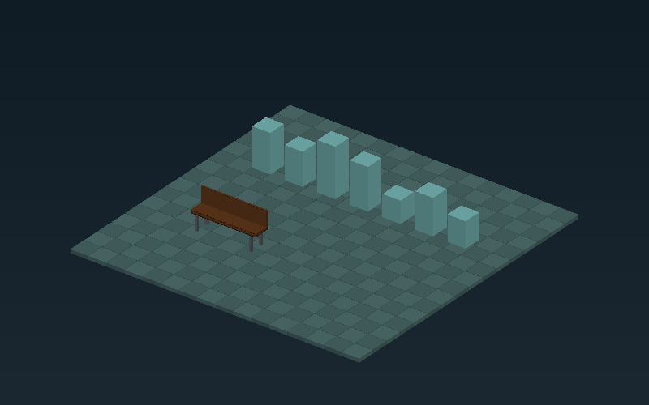

# Native visual playground (0.7.0)



Build the normal SDL-enabled preset, then run `engine_playground` (Windows:
`build\windows-mingw\engine_playground.exe`). The separate foundation host remains available.
The native window shows an orthographic 3D field with boxes and a movable textured Aether bench.
[Asset pipeline and provenance](ASSET_PIPELINE.md).

| Control | Result |
| --- | --- |
| W/A/S/D | Move the bench model in world X/Z |
| Q/E | Orbit the camera |
| Z/X | Zoom out/in |
| Space | Create a crate next to the player (64 entity cap) |
| Backspace | Remove the newest non-player box |
| R | Reset the world and camera |
| Window close | Clean shutdown |

The window title includes the controls. Placement is visual; boxes have no collision.
Floor tiles are presentation geometry, while the player and editable boxes are owned
by F5 World. FixedSystems commits structural changes; F4 ActionSystem maps controls.
Raw F3 input events are consumed once per fixed tick, preserving events over zero-tick
frames and avoiding repeated press edges during catch-up.

The SDL-free Graphics library is a deliberately small CPU raster baseline: 800x500 RGBA,
orthographic orbit camera, flat per-face shading, per-pixel depth, opaque axis-aligned
boxes. Coincident equal-depth surfaces retain the first submitted pixel. Input coordinates
are finite and bounded; malformed sizes/cameras are rejected before modifying the frame.
The SDL backend scales that buffer into a freshly acquired window surface after resize.
No SDL types appear in graphics or scene code. Presentation must run on the main thread.

This is a runnable native integration milestone, not the final GPU renderer. It establishes
camera/world/framebuffer contracts and image tests before adding GPU resources, materials,
textures or general meshes. The renderer is independently implemented; Aether's camera and
primitive layout were reviewed as references, and its adapted seeded generator sets box heights.
Aether code, shader techniques and assets remain adoption candidates in [the subsystem tracker](AETHER_ADOPTION.md).

Automation:

```
engine_playground --headless
engine_playground --smoke
engine_playground --snapshot frame.ppm
```

Headless runs four fixed ticks. Smoke does the same in a hidden SDL window. Snapshot writes
one native renderer frame without initializing SDL. CI uploads screenshots and native binaries;
Windows builds also run tests. See the PR's Actions artifacts for downloadable packages.

Tests cover action movement, single-edge spawn, removal, stale handles after reset, camera
changes, repeatable frames, depth order, malformed renderer input, surface resize and shutdown.
A dummy-driver test proves surface presentation but does not replace human desktop testing.

Next: bring Aether primitive meshes and a credited model/material into the native visual
path, with a loader fixture and visible result. Physics and scene authoring follow that path.
